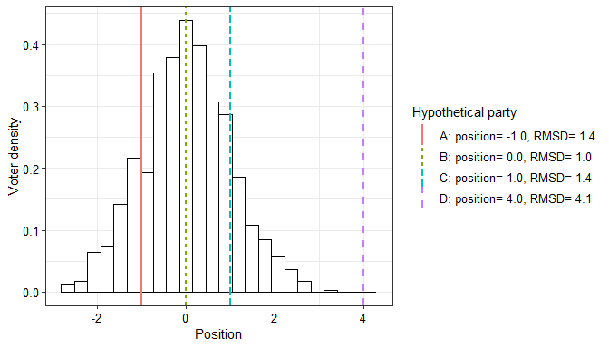
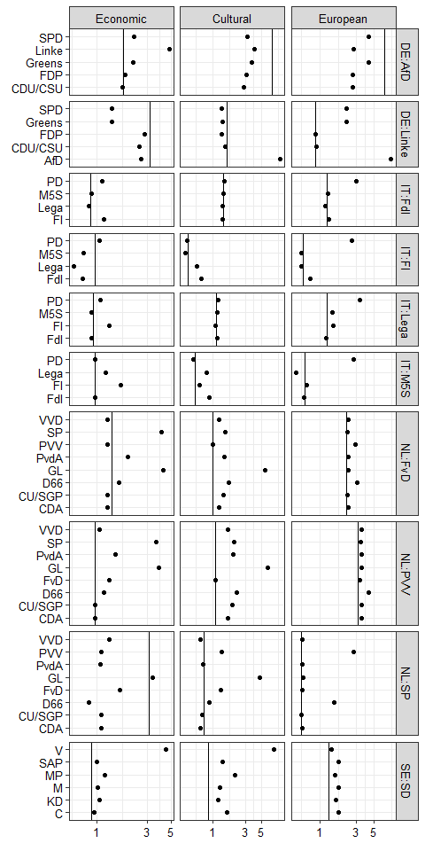
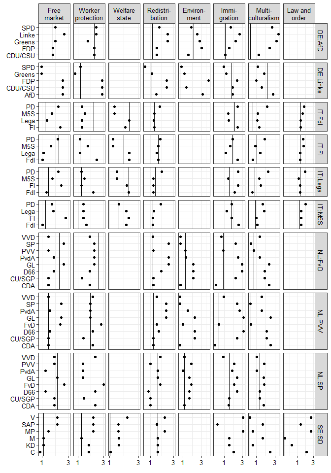
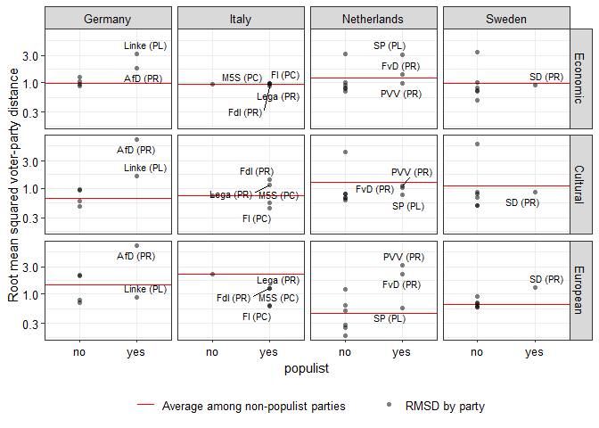
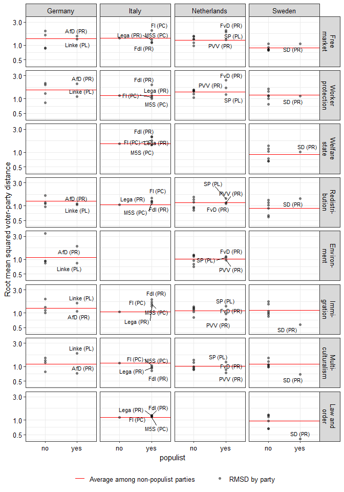
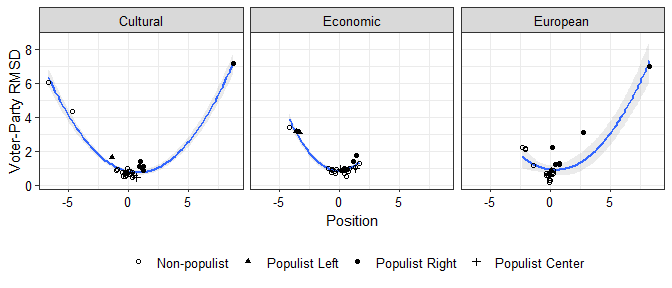

The output of the analysis of party-voter congruence

AZ
2025-02-17

This document replicates the displays included in the following research
note:

Zhirnov, A., Thomeczek, J.P., Scotto Di Vettimo, M., López Ortega, A.,
Krouwel, A., Antonucci, L., Di Stefano, R., Kersting, N. 2025. “How
congruent are populist parties with their constituencies? Evidence from
the 2019 European Parliament Elections in Italy, the Netherlands,
Germany and Sweden.” *Electoral Studies* 94, 102906.
[doi:10.1016/j.electstud.2025.102906](https://doi.org/10.1016/j.electstud.2025.102906)

### Load the necessary packages and set options

### Load the data

To see how the datasets were created, please take a look at the “code”
folder of this repository.

``` r
wtcp0 <- readRDS("data/weights_by_cp.rds")
users0 <- readRDS("data/user_positions.rds")
parties0 <- readRDS("data/party_positions.rds")
parties.dt0 <- read.csv("misc/party details.csv", encoding="UTF-8")
```

### Define a function for computing RMSD

``` r
poldist <- function(pos_u, pos_p, weight = rep(1, length(pos_u))) {
  weight[which(is.na(weight)|is.na(pos_u)|is.na(pos_p))] <- 0
  sqrt(sum((pos_u-pos_p)^2*weight)/sum(weight)) 
}
```

To get an idea about the scale of RMSD, consider the following
illustration. Let’s create a hypothetical party constituency with 1000
voters, each having their policy position drawn from the standard normal
distribution (with mean 0 and standard deviation at 1). The RMSD for
hypothetical parties A (with the position at -1), B (at 0), C (at 1), D
(at 4) will look like this:

``` r
temp_u <- data.frame(pos_u=rnorm(1000))
temp_p <- data.frame(party = c("A","B","C","D"), pos_p = c(-1, 0, 1, 4)) |> 
  cross_join(temp_u) |>
  group_by(party) |>
  summarize(rmsd = poldist(pos_u, pos_p),
            pos_p = median(pos_p)) |>
  mutate(plab = paste0(party, ": position= ", formatC(pos_p, format='f', digits=1L), ", RMSD= ", formatC(rmsd, format='f', digits=1L)))

ggplot(temp_u) +
  geom_histogram(aes(x = pos_u, y =after_stat(density)), bins=nclass.FD(temp_u$pos_u), fill="white", color="black") + 
  geom_vline(aes(xintercept = pos_p, linetype=plab, color=plab), data=temp_p, linewidth=1) +
  labs(x="Position", y="Voter density", linetype="Hypothetical party", color="Hypothetical party")
```

<!-- -->

### Aggregate values by constituency-party-dimension

We use the *poldist()* function to find RMSD for each combination of a
party and a party constituency for each dimension.

``` r
parties.dt <- parties.dt0 |> 
  filter(include=='Y') |> 
  select(cntry, party, popul, vs2019) |>
  mutate(vs2019 = vs2019/100,
         cntry_party = paste0(cntry,":", party))
wtcp <- wtcp0 |> semi_join(parties.dt, by=join_by(cntry_party))
parties <- parties0 |>
  mutate(cntry = substring(cntry_party,1L,2L))
 
agg <- users0 |> 
  inner_join(wtcp, by=join_by(cntry, cntry_party, respid)) |>
  group_by(cntry, cat, cntry_party)|> 
  mutate(center = sum(pos*wt)/sum(wt)) |>  
  inner_join(parties, by=join_by(cntry, cat), suffix=c(".v",".p"), relationship="many-to-many") |>
  group_by(cntry, cat, cntry_party.v, cntry_party.p) |>
  summarize(rmsd=poldist(pos.v, pos.p, wt))|> 
  ungroup() |>
  inner_join(parties.dt, by=join_by(cntry, cntry_party.v==cntry_party)) |>  
  inner_join(parties.dt, by=join_by(cntry, cntry_party.p==cntry_party), suffix = c('.v','.p')) |>
  inner_join(parties, by=join_by(cntry, cat, cntry_party.p==cntry_party))
```

### Define labels for visualizations

``` r
cl.agg <- c(
  "econ"='Economic',
  "cult"="Cultural", 
  "euro"="European"
)
cl.det <- c( 
  "free_market_economy"='Free\nmarket',
  "labour_groups"='Worker\nprotection',  
  "welfare_state"="Welfare\nstate",
  "taxation"='Redistri-\nbution',
  "environment"='Environ-\nment',
  "immigration"='Immi-\ngration',
  "nat_identity"='Multi-\nculturalism',
  "law_n_order"='Law and\norder'
)
countries <- unique(users0$cntry)
cnames <- countrycode::countrycode(countries, 
                                   origin='iso2c',
                                   destination='country.name')
names(cnames) <- countries
```

### Comparison of the distance between a party and its constituency against the distance between other parties and this party’s constituency along aggregate policy dimensions

``` r
sel <-  agg |> 
  filter( popul.v !='OTH' & cat %in% names(cl.agg)) |>
  mutate(
    self = ifelse(cntry_party.v==cntry_party.p, 'Y','N'),
    cat.f = factor(cat, levels=names(cl.agg), labels=cl.agg),
    plab = trimws(substring(cntry_party.p,4L))
    )
  sel <- split(sel, sel$self)
  
  ggplot(data=sel$N,  
                mapping=aes(x=rmsd, y=plab)) +
    geom_point() + 
    geom_vline(aes(xintercept=rmsd), data=sel$Y) +
    facet_grid(cntry_party.v ~ cat.f, scales='free', space='free_y') + 
    scale_x_log10(breaks=c(1,3,5)) +
    expand_limits(x=3) +
    labs(y=element_blank(), x=element_blank()) +
    theme(legend.position='bottom')
```

<!-- -->

### Comparison of the distance between a party and its constituency against the distance between other parties and this party’s constituency along issue-specific dimensions

``` r
sel <-  agg |> 
  filter( popul.v !='OTH' & cat %in% names(cl.det)) |>
  mutate(
    self = ifelse(cntry_party.v==cntry_party.p, 'Y','N'),
    cat.f = factor(cat, levels=names(cl.det), labels=cl.det),
    plab = trimws(substring(cntry_party.p,4L))
    )
  sel <- split(sel, sel$self)
  
  ggplot(data=sel$N,  
                mapping=aes(x=rmsd, y=plab)) +
    geom_point() + 
    geom_vline(aes(xintercept=rmsd), data=sel$Y) +
    facet_grid(cntry_party.v ~ cat.f, scales='free', space='free_y') + 
    scale_x_log10(breaks=c(1,3,5)) +
    expand_limits(x=3) +
    labs(y=element_blank(), x=element_blank()) +
    theme(legend.position='bottom')
```

<!-- -->

### Comparison of distances between a party and its constituency along aggregate dimensions

``` r
## averages  
self <- agg |> 
  filter(cntry_party.v==cntry_party.p & cat %in% names(cl.agg)) |>
  mutate(cat.f = factor(cat, levels=names(cl.agg), labels=cl.agg),
         plab = paste0(substring(cntry_party.p, 4L), ifelse(popul.p=='OTH', '', paste0(' (',popul.p,')'))), 
         populist = ifelse(grepl('^P', popul.p), "yes","no"))

ave <- self |> 
  filter(populist=='no') |>
  group_by(cntry, cat.f) |>
  summarize(ave = sum(rmsd*vs2019.p)/sum(vs2019.p)) |>
  ungroup()
  
ggplot(data=self, mapping=aes(x=populist, y=rmsd)) +  
  geom_hline(data=ave, mapping=aes(yintercept=ave, color='N')) +
  geom_point(alpha=0.5, aes(shape="rmsd"))+
  geom_text_repel(data=subset(self, populist=='yes'), aes(label=plab), size=3) +
  scale_color_manual(breaks='N', values='red', 
                     labels = "Average among non-populist parties")+
  scale_shape_manual(breaks='rmsd', values=16, 
                     labels = "RMSD by party")+
  facet_grid(cat.f ~ cntry, labeller=labeller(cntry=cnames)) +
  scale_y_log10()+
  labs(x="populist", y="Root mean squared voter-party distance", color=element_blank(), shape=element_blank()) +
  theme(legend.position='bottom') 
```

<!-- -->

### Comparison of distances between a party and its constituency along issue dimensions

``` r
## averages  
self <- agg |> 
  filter(cntry_party.v==cntry_party.p & cat %in% names(cl.det)) |>
  mutate(cat.f = factor(cat, levels=names(cl.det), labels=cl.det),
         plab = paste0(substring(cntry_party.p, 4L), ifelse(popul.p=='OTH', '', paste0(' (',popul.p,')'))), 
         populist = ifelse(grepl('^P', popul.p), "yes","no"))

ave <- self |> 
  filter(populist=='no') |>
  group_by(cntry, cat.f) |>
  summarize(ave = sum(rmsd*vs2019.p)/sum(vs2019.p)) |>
  ungroup()
  
ggplot(data=self, mapping=aes(x=populist, y=rmsd)) +  
  geom_hline(data=ave, mapping=aes(yintercept=ave, color='N')) +
  geom_point(alpha=0.5, aes(shape="rmsd"))+
  geom_text_repel(data=subset(self, populist=='yes'), aes(label=plab), size=3) +
  scale_color_manual(breaks='N', values='red', 
                     labels = "Average among non-populist parties")+
  scale_shape_manual(breaks='rmsd', values=16, 
                     labels = "RMSD by party")+
  facet_grid(cat.f ~ cntry, labeller=labeller(cntry=cnames)) +
  scale_y_log10()+
  labs(x="populist", y="Root mean squared voter-party distance", color=element_blank(), shape=element_blank()) +
  theme(legend.position='bottom') 
```

<!-- -->

### Distances and positions along aggregate dimensions

Here we pool all political parties together, which may be a bit of an
overstretch but makes it easier to look for patterns. More extreme
parties seem to be further from their voters than more moderate parties.

``` r
agg |> 
  filter(cntry_party.v==cntry_party.p) |>
  filter(cat %in% names(cl.agg)) |> 
  ggplot(mapping=aes(x=pos, y=rmsd)) +
  geom_smooth(alpha=0.2,  method="lm", formula = y ~ poly(x, 2)) +
  geom_point(aes(shape=popul.p)) +
  scale_shape_manual(breaks=c('OTH','PL','PR','PC'),
                     values=c(1,17, 19, 3),
                     labels=c('Non-populist', 'Populist Left', 'Populist Right','Populist Center')) +
  facet_wrap(vars(cat), labeller=labeller(cat=cl.agg)) +
  labs(x='Position', y='Voter-Party RMSD', shape=element_blank()) +
  theme(legend.position='bottom')
```

<!-- -->

### Distances and positions along issue dimensions

``` r
clcl <- gsub("(-\n)","", cl.det)
clcl <- gsub("(\n)"," ", clcl)

agg |> 
  filter(cntry_party.v==cntry_party.p) |>
  filter(cat %in% names(clcl)) |> 
  ggplot(mapping=aes(x=pos, y=rmsd)) +
  geom_smooth(alpha=0.2,  method="lm", formula = y ~ poly(x, 2)) +
  geom_point(aes(shape=popul.p)) +
  scale_shape_manual(breaks=c('OTH','PL','PR','PC'),
                     values=c(1,17, 19, 3),
                     labels=c('Non-populist', 'Populist Left', 'Populist Right','Populist Center')) +
  facet_wrap(vars(cat), labeller=labeller(cat=clcl)) +
  labs(x='Position', y='Voter-Party RMSD', shape=element_blank()) +
  theme(legend.position='bottom')
```

<!-- -->
